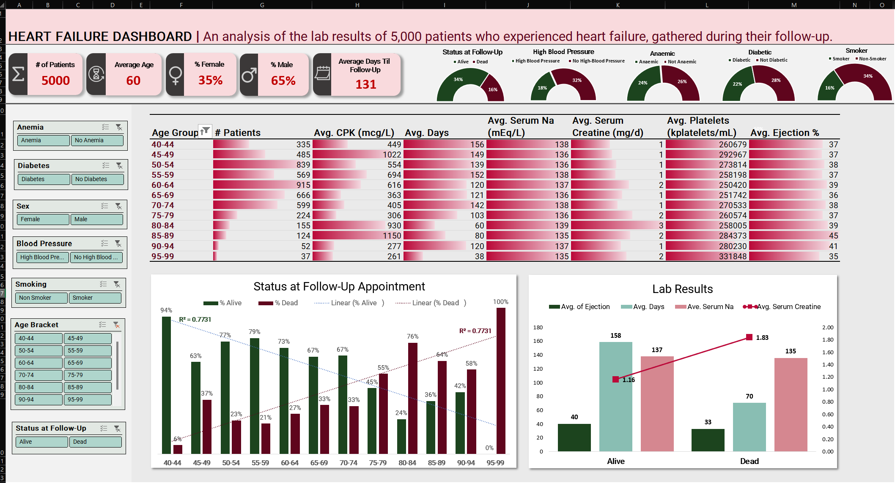
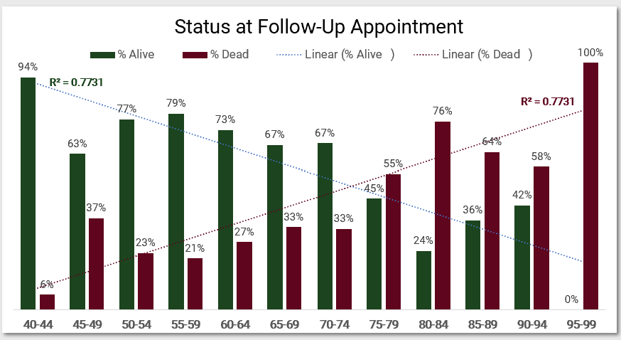
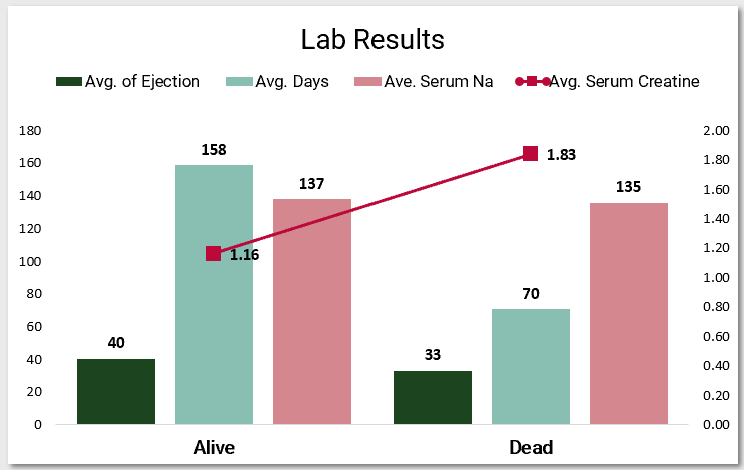
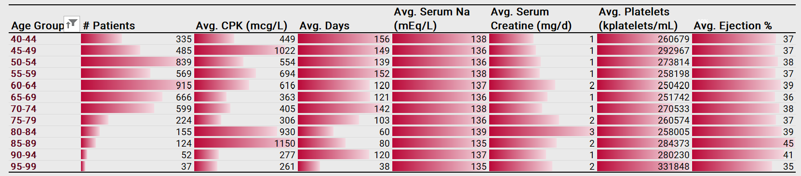

# Heart Failure Excel Analysis and Dashboard
-------------------------------
### Abstract

This project analyzes heart failure clinical records of 5000 patients sourced from Kaggle. Using Excel, a comprehensive dashboard was created to visualize key insights and correlations, such as associations between mortality and factors like age and lab measurements. The dashboard offers an overview of patient demographics and health indicators, facilitating insights into death prediction and clinical management.

-----------------------------
### Table Of Contents

1. [Dataset](#dataset)
2. [Dashboard](#features)
3. [Software Requirements](#installation)
4. [Design Process](#design)
5. [Analysis & Key Findings](#analysis)
6. [Concluding Remarks](#conclusion)
7. [Contact](#contact)
8. [Acknowledgements](#acknowledgements)
9. [License](#license)

----------------------------------
### Dataset

[Heart Failure Clinical Records (Kaggle)](https://www.kaggle.com/datasets/aadarshvelu/heart-failure-prediction-clinical-records)

This dataset contains the medical records and profiles of 5000 patients who have suffered from heart failure, compiled during their follow-up appointments. 

In other words, after a patient experiences heart failure, they undergo follow-up appointments (the criteria for scheduling these appointments are unspecified), during which their medical data is documented. If a patient passes away, they are automatically assigned a follow-up session, during which their medical data is recorded. It's important to note that the laboratory measurements in this dataset pertain specifically to these follow-up appointments and not to the initial instance of heart failure.

There's a discrepancy concerning the timeframe until the follow-up appointment and whether the patient has passed away during that period. If a patient has deceased, they promptly receive their follow-up, while those who survive must wait for their scheduled appointment, typically enduring a longer interval. In this scenario, the time until follow-up is **confounded** with the outcome of interest (patient mortality). This nuance is crucial to consider when developing machine learning models. 

There are 13 features, 6 numerical, 7 categorical (6 boolean):

| Feature               | Description                                                    |
|-----------------------|----------------------------------------------------------------|
| age                   | Age of the patient (years)                                     |
| anaemia               | Decrease of red blood cells or hemoglobin (boolean)            |
| creatine phosphokinase (CPK) | Level of the CPK enzyme in the blood (mcg/L)           |
| diabetes              | If the patient has diabetes (boolean)                          |
| ejection fraction     | Percentage of blood leaving the heart at each contraction (percentage) |
| high blood pressure   | If the patient has hypertension (boolean)                     |
| platelets             | Platelets in the blood (kiloplatelets/mL)                      |
| sex                   | Woman or man (binary)                                          |
| serum creatine    | Level of serum creatinine in the blood (mg/dL)                 |
| serum sodium          | Level of serum sodium in the blood (mEq/L)                     |
| smoking               | If the patient smokes or not (boolean)                         |
| time                  | Follow-up period (days)                                        |
| DEATH_EVENT           | If the patient died during the follow-up period (boolean)      |

----------------------------------
### Dashboard

The dashboard is made up of the following components:
- Title 
- Top bar-- KPIs represented as a single value (e.g. % Female) or a speedometer. 
- Left bar-- Slicers for categorical data e.g. Smoking.
- Top Middle-- Pivot table which breaks down records by age groups (5 years ea.), showing the average for each lab measurement as well as the number of days till follow-up and the number of patients in the group.
- Bottom Middle-- Histogram of age groups and the frequency of being dead or alive at the follow-up appointment; histogram of alive/dead and average lab results. 

-------------------------------
### Software Requirements
The version of Excel that I used is [Professional Plus 2021](https://learn.microsoft.com/en-us/deployoffice/ltsc2021/overview), which requires Windows 10/11.

----------------------------
### Design Process
1. Understand which features are numerical and which are categorical
2. For each binary variable, I created two extra columns, one for each state, so that I can easily sum up each state in a pivot table.
3. Format numbers and text in the table appropriately e.g. change the number of decimal places, convert number to percentage etc...
4. In a new sheet, create a pivot table with the KPIs I want to include in the dashboard, and create slicers for each categorical variable e.g. age, diabetes, etc...
5. All subsequent pivot tables will be copied from the initial one, and changed accordingly, so that the slicers are connected to the new tables. 
6. With so many ways to display data visually, not all would reveal interesting patterns in the dataset. So, I found a shortcut to decide which graphs to show in the dashboard. I did a simple correlation analysis to see which variables are strongly related. First, I made a copy of the data and removed all text columns, keeping only numbers. Then, I used a tool called Analysis Toolpak to create a correlation table. I looked for the strongest relationships (highest r values) and picked graphs that showed those connections best. I focused on showing how death relates to lab results and age, and the two graphs that I used to reflect this are prominently displayed in the bottom-middle of my dashboard.

--------------------
### Analysis & Key Findings

The correlation coefficients between death and various factors are as follows: death & age (0.249), death & ejection fraction (-0.293), death & serum creatinine (0.311), death & serum sodium (-0.227), and death & follow-up time (-0.527). Among these, the relationship between death and follow-up time exhibited the strongest correlation. This is likely because individuals who died were automatically scheduled for a follow-up, while those who survived could wait longer for their appointments. Consequently, I opted not to display this relationship in the dashboard.

In the histogram depicting age groups and their frequencies of alive/dead, the R^2 value is 0.7731. This suggests that a significant portion of the variation in the status of being dead or alive can be explained by age.

In the histogram representing alive/dead and lab measurements, there is a noticeable distinction between the alive and dead groups, regardless of age group.

Regarding specific observations from the data: the platelet count seems to slightly increase with age, average ejection fraction remains consistent, average days decrease with age, and the number of patients peaks between ages 50 and 74 before declining rapidly.

Overall, the differences appeared more pronounced between age groups than between sexes.

A potential limitation in the analysis is the insufficient number of records from individuals older than 74, which could skew relationships related to age. Additionally, there were more male patients, which may also impact the analysis.

-------------------------
### Concluding Remarks

Making my first Excel dashboard was really stressful. At first, when I was setting it up by putting in incomplete graphs, slicers, and other things, it looked messy. But as I worked on things like colors, fonts, and shapes, it all started to look like a proper dashboard. I also had trouble figuring out how to deal with binary features and connecting slicers to charts

-----------------------
### Contact
Feel free to contact me if you have any suggestions or feedback. 

--------------------------
### Acknowledgements
Thank you to [MyOnlineTrainingHub](https://www.youtube.com/watch?v=1ic8E58Bo2M&list=PLQW1wsHNKi3i-NvlSAooPm1KI1qH3hkDh) for teaching me how to create my first Excel dashboard. 

The dataset was acquired from [this Kaggle](https://www.kaggle.com/datasets/aadarshvelu/heart-failure-prediction-clinical-records) page, which, in turn, acquired its data from this [UC Irvine Repository](https://archive.ics.uci.edu/dataset/519/heart+failure+clinical+records). 

----------------------
### License
This project is licensed under the [MIT License](https://opensource.org/licenses/MIT).

